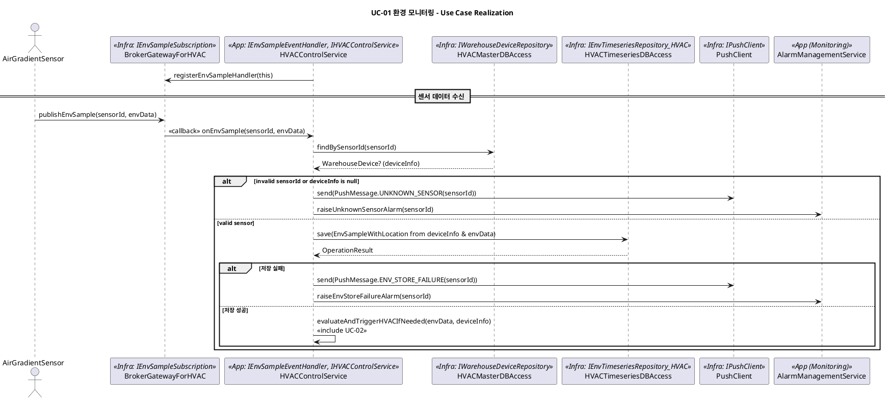
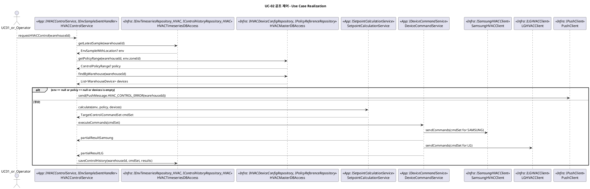
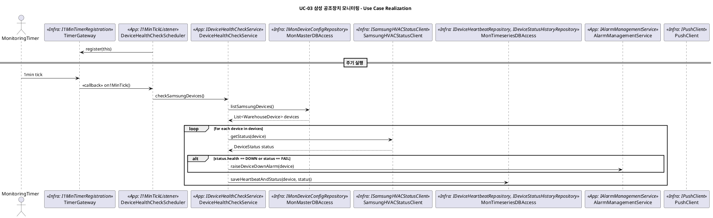

========================================================================================================================================================================================================================================================================================


좋다, 이제 이걸 “진짜 코드 짤 수 있을 만큼” 인터페이스/데이터타입 정의까지 내려보자.
요구한 것처럼:

* 공통 DataType/Enum 먼저 정의
* 각 서버별로 **Provided / Required 인터페이스를 레이어 기준으로 분리**
* 각 오퍼레이션의 파라미터/리턴 타입을 전부 명시

구체 언어는 안 박고, 타입 이름만 딱 보면 설계 리뷰에서 읽히도록 써둘게.

---

## 0. 공통 DataType / Enum 정의

### ID 계열

```text
type SensorId        = string
type WarehouseId     = string
type ZoneId          = string       // 창고 내 존/셀러 단위
type DeviceId        = string       // 공조 장치, 센서 장치 등
type ManufacturerId  = string       // "SAMSUNG", "LG", ...
type AlarmId         = string
type CommandId       = string
```

### 환경 측정 관련

```text
type Timestamp       = datetime

enum EnvMetricType { TEMP, HUMID, CO2, PM25, VOC }

struct EnvSample {
  sensorId: SensorId
  warehouseId?: WarehouseId  // 매핑 후 사용할 수 있음
  zoneId?: ZoneId
  measuredAt: Timestamp
  temperature?: float
  humidity?: float
  co2?: float
  pm25?: float
  voc?: float
}

struct EnvSampleWithLocation {
  warehouseId: WarehouseId
  zoneId: ZoneId
  measuredAt: Timestamp
  temperature?: float
  humidity?: float
  co2?: float
  pm25?: float
  voc?: float
}
```

### 정책/프로파일/제어

```text
struct ZoneProfile {
  warehouseId: WarehouseId
  zoneId: ZoneId
  targetTempRange: (float min, float max)
  targetHumidityRange: (float min, float max)
  targetCo2Max?: float
  targetPm25Max?: float
}

struct ControlPolicyRange {
  warehouseId: WarehouseId
  zoneId: ZoneId
  tempMin: float
  tempMax: float
  humidityMin: float
  humidityMax: float
  co2Max?: float
  pm25Max?: float
}

enum DeviceType { HVAC, AIR_PURIFIER, VENTILATION, HUMIDIFIER, DEHUMIDIFIER }

enum ManufacturerType { SAMSUNG, LG }

struct WarehouseDevice {
  deviceId: DeviceId
  warehouseId: WarehouseId
  zoneId: ZoneId
  manufacturer: ManufacturerType
  deviceType: DeviceType
  address: string           // API endpoint or logical address
}

struct TargetControlCommand {
  commandId: CommandId
  warehouseId: WarehouseId
  zoneId: ZoneId
  deviceId: DeviceId
  mode: string              // 예: "COOL", "HEAT", ...
  setTemp?: float
  setHumidity?: float
  fanSpeed?: int
  etcOptions: map<string, string>
}
```

### 장치 상태/모니터링

```text
enum HealthState { NORMAL, WARN, DOWN, UNKNOWN }

struct DeviceStatus {
  deviceId: DeviceId
  warehouseId: WarehouseId
  checkedAt: Timestamp
  health: HealthState
  detailMessage?: string
}

struct HeartbeatRecord {
  deviceId: DeviceId
  warehouseId: WarehouseId
  checkedAt: Timestamp
  success: bool
  responseTimeMs?: int
}
```

### 알람 / 결과 공통

```text
enum AlarmSeverity { INFO, WARN, ERROR, CRITICAL }

enum AlarmType {
  UNKNOWN_SENSOR,
  ENV_STORE_FAILURE,
  HVAC_CONTROL_ERROR,
  DEVICE_DOWN,
  PUSH_SERVER_ERROR
}

struct AlarmEvent {
  alarmId: AlarmId
  type: AlarmType
  severity: AlarmSeverity
  occurredAt: Timestamp
  warehouseId?: WarehouseId
  deviceId?: DeviceId
  message: string
}

enum PushStatus { SUCCESS, TEMP_FAILURE, PERM_FAILURE }

struct OperationResult {
  success: bool
  errorCode?: string
  message?: string
}
```

이걸 기반으로 서버별 인터페이스를 깔끔히 나눈다.

---

## 1. Wine Cellar Ops Server

Ops는 **Master/TS DB 기반 비즈니스/조회 서버**. 브로커/센서 직접 X.

### 1-1. Presentation Layer – Provided APIs

(외부/운영자/다른 서버에서 호출)

**IEnvMonitoringAPI (Provided by EnvMonitoringController)**

```text
EnvStatusView getCurrentEnvStatus(warehouseId: WarehouseId, zoneId?: ZoneId)

EnvHistoryView getEnvHistory(
  warehouseId: WarehouseId,
  zoneId: ZoneId,
  from: Timestamp,
  to: Timestamp
)
```

**IControlPolicyAPI (Provided by ControlPolicyController)**

```text
OperationResult defineZoneProfile(profile: ZoneProfile)

ZoneProfile getZoneProfile(warehouseId: WarehouseId, zoneId: ZoneId)
```

**IInventoryAPI (Provided by InventoryController)**

```text
OperationResult registerInOutEvent(event: InOutEvent)

InOutHistoryView getInOutHistory(warehouseId: WarehouseId, period: TimeRange)
```

**IAlarmPolicyAPI (Provided by AlarmPolicyController)**

```text
OperationResult defineAlarmRule(rule: AlarmRule)

AlarmRule getAlarmRule(ruleId: string)
```

**IDeviceConfigAPI (Provided by DeviceConfigController)**

```text
OperationResult registerWarehouseDevice(device: WarehouseDevice)

WarehouseDevice getWarehouseDevice(deviceId: DeviceId)
List<WarehouseDevice> listWarehouseDevices(warehouseId: WarehouseId)
```

### 1-2. Application Layer – Provided Services / Required Infra

#### IEnvStatusQueryService (Provided by EnvStatusQueryService)

```text
EnvStatusView getCurrentEnvStatus(warehouseId: WarehouseId, zoneId?: ZoneId)

EnvHistoryView getEnvHistory(
  warehouseId: WarehouseId,
  zoneId: ZoneId,
  from: Timestamp,
  to: Timestamp
)
```

**Requires (downwards):**

* `IEnvTimeseriesRepository`
* `IWarehouseDeviceRepository`

#### IZoneProfileService (Provided by ZoneProfileService)

```text
OperationResult defineZoneProfile(profile: ZoneProfile)
ZoneProfile getZoneProfile(warehouseId: WarehouseId, zoneId: ZoneId)
```

**Requires:** `IZoneProfileRepository`

#### IControlPolicyService (Provided by ControlPolicyService)

(Ops에서 정책 계산·시뮬레이션 용도)

```text
ControlPolicyRange getPolicyRange(warehouseId: WarehouseId, zoneId: ZoneId)

ControlSimulationResult simulateControl(
  warehouseId: WarehouseId,
  zoneId: ZoneId,
  currentEnv: EnvSampleWithLocation
)
```

**Requires:**

* `IZoneProfileRepository`
* `IEnvTimeseriesRepository`
* `IControlHistoryRepository`
* `IWarehouseDeviceRepository`
* (옵션) `IKEPCOClient`

#### IInventoryEventService

```text
OperationResult applyInOutEvent(event: InOutEvent)
InOutHistoryView getInOutHistory(warehouseId: WarehouseId, range: TimeRange)
```

**Requires:** `IInventoryRepository`, `IWarehouseSystemClient`

#### IAlarmRuleService

```text
OperationResult defineAlarmRule(rule: AlarmRule)
AlarmRule getAlarmRule(ruleId: string)
```

**Requires:** `IAlarmRuleRepository`

#### IDeviceConfigService

```text
OperationResult registerWarehouseDevice(device: WarehouseDevice)
WarehouseDevice getWarehouseDevice(deviceId: DeviceId)
List<WarehouseDevice> listDevices(warehouseId: WarehouseId)
```

**Requires:** `IWarehouseDeviceRepository`

### 1-3. Infrastructure Layer – Provided / Required

**Repositories (Provided)**

```text
IZoneProfileRepository
  +save(profile: ZoneProfile): OperationResult
  +find(warehouseId, zoneId): ZoneProfile?

IWarehouseDeviceRepository
  +save(device: WarehouseDevice): OperationResult
  +find(deviceId): WarehouseDevice?
  +listByWarehouse(warehouseId): List<WarehouseDevice>

IInventoryRepository
  +save(event: InOutEvent): OperationResult
  +list(warehouseId, range): List<InOutEvent>

IAlarmRuleRepository
  +save(rule: AlarmRule): OperationResult
  +find(ruleId): AlarmRule?
```

**TimeSeries (Provided)**

```text
IEnvTimeseriesRepository
  +save(sample: EnvSampleWithLocation): OperationResult
  +query(warehouseId, zoneId, range): List<EnvSampleWithLocation>

IControlHistoryRepository
  +save(history: ControlHistoryRecord): OperationResult
  +list(warehouseId, range): List<ControlHistoryRecord>

IDeviceStatusTimeseriesRepository
  +save(status: DeviceStatus): OperationResult
  +list(warehouseId, range): List<DeviceStatus>
```

**External Clients (Provided)**

```text
IWarehouseSystemClient
  +notifyInOutSynced(event: InOutEvent): OperationResult

IKEPCOClient
  +getPowerUsage(warehouseId, range): PowerUsageView

IPushClient
  +send(message: PushMessage): PushStatus
```

**Required by Repos/Clients:** DB connection, HTTP 등 infra 디테일 (여기선 생략)

---

## 2. HVAC 서버

핵심: 브로커 이벤트 → `HVACControlService` 콜백, 제조사별 제어.

### 2-1. Presentation – Provided

**IHVACControlAPI (HVACApiController)**

```text
OperationResult requestImmediateControl(warehouseId: WarehouseId)

HVACControlStatusView getControlStatus(warehouseId: WarehouseId, zoneId?: ZoneId)
```

**IHVACStatusAPI**

```text
HVACControlStatusView getLastControlResult(commandId: CommandId)
```

### 2-2. Application – Provided / Required

#### IHVACControlService (Provided by HVACControlService)

```text
OperationResult requestHVACControl(warehouseId: WarehouseId)

/* 콜백: 브로커에서 직접 호출, Provided interface */
onEnvSample(sensorId: SensorId, envData: EnvSample)         // from IEnvSampleEventHandler
onItemEvent(event: InOutEvent)                              // from IInOutEventHandler
```

**Requires (downwards):**

* `IEnvSampleSubscription` (for register)
* `IInOutEventSubscription`
* `IHVACDeviceConfigRepository`
* `IPolicyReferenceRepository`
* `ISetpointCalculationService`
* `IDeviceCommandService`

#### ISetpointCalculationService

```text
TargetControlCommandSet calculate(
  env: EnvSampleWithLocation,
  policy: ControlPolicyRange,
  devices: List<WarehouseDevice>
)
```

**Requires:** `IEnvTimeseriesRepository_HVAC` (history 기반 계산 시)

#### IDeviceCommandService

```text
OperationResult executeCommands(commands: TargetControlCommandSet)
```

**Requires:**

* `IDeviceCommandPublishing` (if via broker)
* `ISamsungHVACClient`, `ILGHVACClient`
* `IControlHistoryRepository_HVAC`

#### IHVACStatusQueryService

```text
HVACControlStatusView getStatus(warehouseId: WarehouseId, zoneId?: ZoneId)
HVACControlStatusView getByCommandId(commandId: CommandId)
```

**Requires:** `IControlHistoryRepository_HVAC`, `IHVACDeviceConfigRepository`

### 2-3. Infrastructure – Provided / Callback

**Kafka Gateway (Provided)**

```text
IEnvSampleSubscription
  +registerEnvSampleHandler(h: IEnvSampleEventHandler): void

IInOutEventSubscription
  +registerInOutEventHandler(h: IInOutEventHandler): void

IDeviceCommandPublishing
  +publishDeviceCommand(cmd: TargetControlCommand): OperationResult
```

**HVAC DB (Provided)**

```text
IHVACDeviceConfigRepository
  +findByWarehouse(warehouseId): List<WarehouseDevice>
  +findById(deviceId): WarehouseDevice?

IPolicyReferenceRepository
  +getPolicyRange(warehouseId, zoneId): ControlPolicyRange?

IEnvTimeseriesRepository_HVAC
  +getLatestSample(warehouseId, zoneId): EnvSampleWithLocation?

IControlHistoryRepository_HVAC
  +save(record: ControlHistoryRecord): OperationResult
  +findByCommandId(commandId): ControlHistoryRecord?
  +list(warehouseId, range): List<ControlHistoryRecord>
```

**Vendor Clients (Provided)**

```text
ISamsungHVACClient
  +sendCommands(commands: TargetControlCommandSet): OperationResult

ILGHVACClient
  +sendCommands(commands: TargetControlCommandSet): OperationResult
```

**Callback 사용**

* `BrokerGatewayForHVAC` 는 실제 이벤트 시:

  * `IEnvSampleEventHandler.onEnvSample(...)`
  * `IInOutEventHandler.onItemEvent(...)`
    호출 (상위 Provided 인터페이스).

---

## 3. Monitoring 서버

Timer + Vendor API로 공조 장치 Heartbeat만 관리.

### 3-1. Presentation – Provided

**IMonitoringQueryAPI**

```text
List<DeviceStatus> getDeviceStatuses(warehouseId: WarehouseId)

List<HeartbeatRecord> getHeartbeatHistory(
  warehouseId: WarehouseId,
  deviceId: DeviceId,
  range: TimeRange
)
```

**IAlarmQueryAPI**

```text
List<AlarmEvent> getActiveAlarms(warehouseId?: WarehouseId)
List<AlarmEvent> getAlarmHistory(warehouseId?: WarehouseId, range?: TimeRange)
```

### 3-2. Application – Provided / Required

#### I1MinTickListener (Provided by DeviceHealthCheckScheduler)

```text
on1MinTick(): void
```

#### IDeviceHealthCheckService

```text
checkSamsungDevices(): void
checkLGDevices(): void
```

(실제 구현에선 제조사 파라미터 1개로 합쳐도 됨)

**Requires:**

* `IMonDeviceConfigRepository`
* `ISamsungHVACStatusClient` / `ILGHVACStatusClient`
* `IDeviceHeartbeatRepository`
* `IAlarmManagementService` (DOWN or FAIL 시 알람 요청)

#### IAlarmManagementService

```text
raiseDeviceDownAlarm(device: WarehouseDevice): AlarmEvent
closeDeviceAlarmIfRecovered(device: WarehouseDevice): OperationResult
List<AlarmEvent> getActiveAlarms(warehouseId?: WarehouseId)
List<AlarmEvent> getAlarmHistory(warehouseId?: WarehouseId, range?: TimeRange)
```

**Requires:**

* `IPushClient`
* `IDeviceStatusHistoryRepository`

#### IMonitoringQueryService

```text
List<DeviceStatus> getDeviceStatuses(warehouseId: WarehouseId)
List<HeartbeatRecord> getHeartbeatHistory(
  warehouseId: WarehouseId,
  deviceId: DeviceId,
  range: TimeRange
)
```

**Requires:**

* `IDeviceHeartbeatRepository`
* `IDeviceStatusHistoryRepository`

#### DeviceHealthCheckScheduler (Provided / Required)

* **Provided:** `I1MinTickListener.on1MinTick()`
* **Requires:** `I1MinTimerRegistration` (타이머 등록), `IDeviceHealthCheckService`

### 3-3. Infrastructure – Provided / Callback

**Timer**

```text
I1MinTimerRegistration
  +register(listener: I1MinTickListener): void
```

Timer 엔진은 1분마다 `listener.on1MinTick()` 호출 (callback).

**Repositories**

```text
IMonDeviceConfigRepository
  +listSamsungDevices(): List<WarehouseDevice>
  +listLGDevices(): List<WarehouseDevice>

IDeviceHeartbeatRepository
  +save(record: HeartbeatRecord): OperationResult
  +list(warehouseId, deviceId, range): List<HeartbeatRecord>

IDeviceStatusHistoryRepository
  +save(status: DeviceStatus): OperationResult
  +list(warehouseId?: WarehouseId, range?: TimeRange): List<DeviceStatus>
```

**Vendor Status Clients**

```text
ISamsungHVACStatusClient
  +getStatus(device: WarehouseDevice): DeviceStatus

ILGHVACStatusClient
  +getStatus(device: WarehouseDevice): DeviceStatus
```

**Push**

```text
IPushClient
  +send(message: PushMessage): PushStatus
```

---

## 정리 포인트 (검토용)

* 각 인터페이스는 **어느 레이어에서 제공(Provided)**, **위 레이어/서비스에서 무엇을 Require하는지**가 명확하게 갈린 상태.
* UC 4.1.4.2.3 / 4.1.5.5 / 4.1.6.5의 플로우는:

  * UC-01: `IEnvSampleSubscription` + `IEnvSampleEventHandler` / TS repo / PushClient 로 직접 매핑.
  * UC-02: `IHVACControlService` + 정책/장치 repo + VendorClient.
  * UC-03/04: `I1MinTimerRegistration` + `I1MinTickListener` + VendorStatusClient + TS repo.
* 하위→상위 직접 의존은 전부 **콜백 인터페이스(상위 제공) 사용**으로 정리되어 있어, 피드백의 layered 규칙과도 충돌 없음.

이 정도면 설계 리뷰 때 “각 UC가 어떤 컴포넌트/인터페이스를 통해 흘러가는지”를 코드 레벨까지 바로 보일 수 있을 거야.
다음 단계에서 원하면, 이 정의들을 표 형태(Provided/Required matrix)로도 정리해 줄게.


========================================================================================================================================================================================================================================================================================


좋다, 이제 **지금까지 정리한 인터페이스/데이터타입 기준으로** UC 시퀀스를 다시 그려볼게.

아래 PlantUML들은:

* 레이어/서버/컴포넌트 구조와 **완전히 일치**하도록 고쳤고
* 콜백/타이머도 전부 “상위가 인터페이스 제공 → 하위가 `<<callback>>` 호출” 패턴으로 표현했으며
* 이전 버전에서 애매했던 “App → UI 직접 호출”은 대부분 **알람 서비스/Push/조회 API로 우회**해서 레이어 위배 안 나도록 손봤다.

필요하면 그대로 복붙해서 돌려봐도 된다.

---

## UC-01 환경 모니터링 (4.1.4.2.3)

센서 값 수신 → 센서 유효성 검증 → 환경 측정치 저장 → 오류 시 Push/알람.



**코멘트**

* Flow 문서의 “등록되지 않은 센서 알림 / 저장 실패 알림 / UC 종료”를 그대로 반영.
* UI 표시는 알람/Push 기반으로 별도 UC에서 조회하는 걸로 처리해서, HVAC App → Presentation 직접의존 제거.

---

## UC-02 공조 제어 (4.1.5.5)

공조 제어 요청 → 데이터 검증 → 정책 비교 → 제조사별 명령 → 이력 저장.



**코멘트**

* Flow의 “필요 정보 중 하나라도 null → Push로 불가 알림 후 종료”를 alt 블록으로 표현.
* 제조사 분기(삼성/ LG)를 `DeviceCommandService`와 Vendor 클라이언트에서 처리.
* 레이어 상→하, 인터페이스 이름(EnvTimeseries, PolicyRange 등)과 일치.

---

## UC-03 삼성 공조장치 모니터링 (4.1.6.5 일부)

Timer 기반 삼성 장치 상태 확인. (LG는 UC-04로 동일 패턴.)



**UC-04 LG 공조장치 모니터링**

* 위 다이어그램에서 `SamsungHVACStatusClient` / `listSamsungDevices()` → `LGHVACStatusClient` / `listLGDevices()`로만 교체.

**코멘트**

* Flow 4.1.6.5의 “Timer → 장치목록 조회 → 상태 요청 → 실패 시 Push → 상태 저장” 그대로.
* Push는 `AlarmManagementService` + `IPushClient`에서 처리하게 해서 책임 분리.
* Timer 콜백 구조 (상위 제공 I1MinTickListener, 하위 TimerGateway에서 callback)가 명확히 보임.

---

## 잠깐 체크: 문제 될 수 있는 부분

1. **서버 간 호출 표현**

   * 시퀀스에서 `AlarmManagementService` 를 HVAC/Monitoring 서버 어디에 둘지 실제 배치에 따라 나뉠 수 있는데,
   * 지금은 “Monitoring 서버 App”으로 보고 사용.
     → 실제 구현에선 HVAC 서버가 알람 서버 API를 부르는 형태가 되므로, 배치/컴포넌트 다이어그램에서 서버 간 HTTP 호출로 그려주면 정합성 생김.

2. **UI 표시**

   * Flow 문서에 나오는 “모니터링 화면에 표시”는 여기 시퀀스에서는 **알람/상태 조회 UC로 분리**해서 처리하고 있다.
   * 만약 심사자가 “왜 여기서 바로 화면 호출 안 하냐”고 묻는다면:

     * 레이어 원칙 때문이고, 화면은 별도 UC(상태 조회)에서 `IMonitoringQueryAPI`로 가져간다고 설명하면 된다.

이 버전 기준으로 UC/컴포넌트/레이어가 전부 맞물리니까, 그대로 보고서 Behavior View에 넣어도 무난하다.
다음에 원하면 각 UC에 대해 “Step No. ↔ 메시지 번호” 매핑 표도 만들어 줄게.


