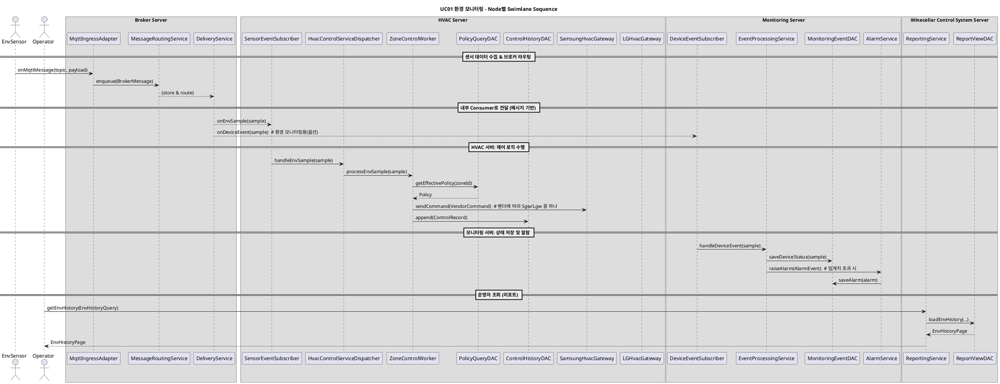
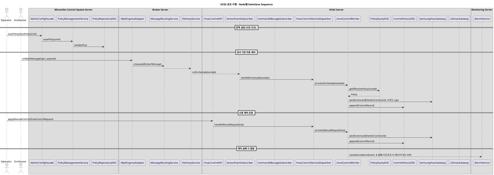
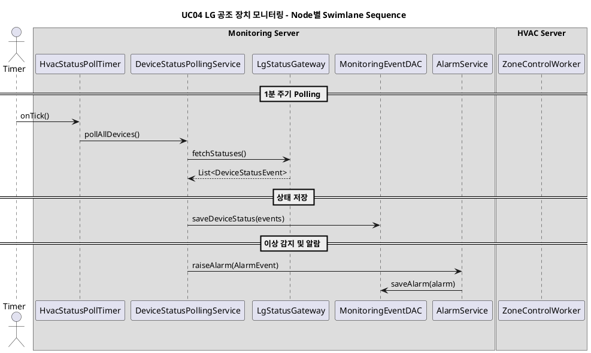

좋다, 이제 이 버전을 “문서에 바로 넣을 수 있는 수준”으로 정리해볼게.
형식은:

* 서버별 3계층 컴포넌트 구성
* 각 컴포넌트가 **위/아래 어떤 인터페이스를 제공/사용하는지**
* 각 인터페이스에 대해

  * 주요 오퍼레이션 시그니처
  * 필요한 핵심 DataType / Enum
  * 인터페이스 역할

공통 타입은 마지막에 모아서 적을게.

---

## 1. 와인셀러 공조 시스템 서버

### L1. Presentation / API

#### 1) AdminConfigFacade

* **Provides**

  * `IAdminConfigService`
* **Uses**

  * `IPolicyManagement`
  * `IZoneProfileManagement`
  * `IEquipmentRegistration`
* **IAdminConfigService**

  * `createWarehouseProfile(cmd: CreateWarehouseProfileCmd): void`
  * `updateWarehouseProfile(cmd: UpdateWarehouseProfileCmd): void`
  * `registerDevice(cmd: RegisterDeviceCmd): void`
  * `updateDevice(cmd: UpdateDeviceCmd): void`
* **역할**

  * 관리자 UI/API 진입점. 마스터/정책 관련 요청을 L2 서비스에 위임.

#### 2) OperatorViewFacade

* **Provides**

  * `IOperatorViewService`
* **Uses**

  * `IPolicyQuery`
  * `IReportQuery`
* **IOperatorViewService**

  * `getZoneProfile(zoneId: ZoneId): ZoneProfile`
  * `getPolicies(filter: PolicyQuery): PolicySummaryList`
  * `getReports(query: KpiQuery): KpiSummary`
* **역할**

  * 운영자 조회 전용 파사드.

#### 3) WarehouseIntegrationAPI

* **Provides**

  * `IWarehouseIntegrationAPI`
* **Uses**

  * `IInventoryIntegration`
* **IWarehouseIntegrationAPI**

  * `notifyInbound(event: InboundEvent): Ack`
  * `notifyOutbound(event: OutboundEvent): Ack`
* **역할**

  * 창고 WMS와의 입출고 이벤트 연동 진입점.

---

### L2. Business

#### 1) PolicyManagementService

* **Provides**

  * `IPolicyManagement`
  * `IPolicyQuery`
* **Uses**

  * `IPolicyRepositoryDAC`
* **IPolicyManagement**

  * `savePolicy(cmd: SavePolicyCmd): void`
  * `disablePolicy(policyId: PolicyId): void`
* **IPolicyQuery**

  * `getPolicy(policyId: PolicyId): Policy`
  * `findPolicies(filter: PolicyQuery): PolicySummaryList`
* **역할**

  * 공조 정책 수명주기 관리, 조회.

#### 2) ZoneProfileService

* **Provides**

  * `IZoneProfileManagement`
* **Uses**

  * `IZoneRepositoryDAC`
* **IZoneProfileManagement**

  * `saveZoneProfile(cmd: SaveZoneProfileCmd): void`
  * `getZoneProfile(zoneId: ZoneId): ZoneProfile`
* **역할**

  * 창고/존 설정 관리.

#### 3) EquipmentRegistrationService

* **Provides**

  * `IEquipmentRegistration`
* **Uses**

  * `IEquipmentRepositoryDAC`
* **IEquipmentRegistration**

  * `registerDevice(cmd: RegisterDeviceCmd): void`
  * `updateDevice(cmd: UpdateDeviceCmd): void`
* **역할**

  * 센서/공조장치 메타, 브로커 토픽 매핑 관리.

#### 4) InventoryIntegrationService

* **Provides**

  * `IInventoryIntegration`
* **Uses**

  * `IWarehouseSystemGateway`
* **IInventoryIntegration**

  * `handleInbound(event: InboundEvent): void`
  * `handleOutbound(event: OutboundEvent): void`
* **역할**

  * 입출고 이벤트를 정책/존/재고 정보와 연결.

#### 5) ReportingService

* **Provides**

  * `IReportQuery`
* **Uses**

  * `IReportViewDAC`
* **IReportQuery**

  * `getEnvHistory(query: EnvHistoryQuery): EnvHistoryPage`
  * `getControlHistory(query: ControlHistoryQuery): ControlHistoryPage`
  * `getKpiSummary(query: KpiQuery): KpiSummary`
* **역할**

  * 리포트용 조회 서비스.

---

### L3. DataAccess / Gateway

각 DAC는 “DB 접근만” 담당.

* **IPolicyRepositoryDAC**

  * `findById(policyId): Policy`
  * `save(policy: Policy): void`
* **IZoneRepositoryDAC**

  * `findById(zoneId): ZoneProfile`
  * `save(profile: ZoneProfile): void`
* **IEquipmentRepositoryDAC**

  * `findById(deviceId): DeviceInfo`
  * `save(device: DeviceInfo): void`
* **IReportViewDAC**

  * 집계/뷰 테이블 조회.
* **IWarehouseSystemGateway**

  * `sendEventToWms(event): Ack` 등, 실제 WMS 연동.

---

## 2. 브로커 서버

### L1. Ingress / Client API

#### 1) MqttIngressAdapter

* **Provides**

  * `IMqttIngress`
* **Uses**

  * `IEnqueueMessage`
* **IMqttIngress**

  * `onMqttMessage(topic: String, payload: Binary): Ack`
* **역할**

  * 외부 MQTT 메시지를 내부 BrokerMessage로 변환 후 Core로 전달.

#### 2) HttpIngressAdapter

* **Provides**

  * `IHttpIngress`
* **Uses**

  * `IEnqueueMessage`
* **IHttpIngress**

  * `postMessage(topic: String, body: JsonMessage): Ack`
* **역할**

  * Webhook/HTTP 기반 메시지 수신.

#### 3) InternalPublishAPI

* **Provides**

  * `IInternalPublish`
* **Uses**

  * `IEnqueueMessage`
* **IInternalPublish**

  * `publish(msg: BrokerMessage): Ack`
* **역할**

  * 내부 서버(HVAC/Monitoring)가 브로커로 보내는 인터페이스.

#### 4) SubscriptionAccessAPI

* **Provides**

  * `ISubscriptionAccess`
* **Uses**

  * `ISubscriptionQuery`, `IDeliveryService`
* **ISubscriptionAccess**

  * `register(subReq: SubscribeRequest): Ack`
  * `unregister(subscriberId: SubscriberId): Ack`
  * `pull(subscriberId: SubscriberId, maxCount: int): BrokerMessageBatch`
* **역할**

  * 내부 Consumer가 구독/메시지 pull 할 진입점.

---

### L2. Broker Core

#### 1) MessageRoutingService

* **Provides**

  * `IEnqueueMessage`
* **Uses**

  * `IBrokerMetaStoreDAC`
* **IEnqueueMessage**

  * `enqueue(msg: BrokerMessage): Ack`
* **역할**

  * 토픽/키 기준 큐 배치, 메타 저장, (내부적으로 QoS/Retry 포함).

#### 2) SubscriptionManager

* **Provides**

  * `ISubscriptionQuery`
* **Uses**

  * `IBrokerMetaStoreDAC`
* **ISubscriptionQuery**

  * `getSubscriptions(subscriberId): SubscriptionInfo`
* **역할**

  * 구독 정보 관리.

#### 3) DeliveryService

* **Provides**

  * `IDeliveryService`
* **Uses**

  * `IBrokerMetaStoreDAC`
* **IDeliveryService**

  * `pull(subscriberId, maxCount): BrokerMessageBatch`
* **역할**

  * Consumer용 메시지 전달.

---

### L3. MetaStore DAC

* **IBrokerMetaStoreDAC**

  * `storeMessage(meta: MessageMeta): void`
  * `loadMessages(subscriberId, maxCount): BrokerMessageBatch`
  * `saveOffset(subscriberId, offset: Offset): void`
  * `saveSubscription(info: SubscriptionInfo): void`
  * `storeDeadLetter(msg: BrokerMessage, reason: String): void`
* **역할**

  * 브로커 메타데이터 전용 저장소.

---

## 3. HVAC 서버 (Dispatcher + Parallel Workers)

### L1. API / Subscribers

#### 1) HvacControlAPI

* **Provides**

  * `IHvacControlRequest`
* **Uses**

  * `IHvacControlService`
* **IHvacControlRequest**

  * `applyManualControl(req: ZoneControlRequest): Ack`
  * `applyPolicyOverride(req: PolicyOverrideRequest): Ack`
* **역할**

  * 운영자/상위 시스템의 수동 제어 요청 진입점.

#### 2) SensorEventSubscriber

* **Provides**

  * `ISensorEventReceiver`
* **Uses**

  * `IHvacControlService`
* **ISensorEventReceiver**

  * `onEnvSample(sample: EnvSample): void`
* **역할**

  * 브로커에서 들어온 센서 값 이벤트 수신.

#### 3) CommandMessageSubscriber

* **Provides**

  * `ICommandMessageReceiver`
* **Uses**

  * `IHvacControlService`
* **ICommandMessageReceiver**

  * `onControlCommand(cmd: ControlCommand): void`
* **역할**

  * 브로커 기반 ControlCommand 수신.

---

### L2. Business

#### 1) HvacControlServiceDispatcher

* **Provides**

  * `IHvacControlService`
* **Uses**

  * `IZoneControlWorker` (여러 개)
* **IHvacControlService**

  * `handleEnvSample(sample: EnvSample): void`
  * `handleControlCommand(cmd: ControlCommand): void`
  * `handleManualRequest(req: ZoneControlRequest): void`
* **역할**

  * 단일 진입 포트.
  * zoneId/warehouseId 기반으로 적절한 `ZoneControlWorker`에 라우팅.

#### 2) ZoneControlWorker (20개 병렬)

* **Provides**

  * `IZoneControlWorker`
* **Uses**

  * `IPolicyQueryDAC`
  * `IControlHistoryDAC`
  * `IVendorControlGateway`
  * (도움용) `PolicyEvaluator`
* **IZoneControlWorker**

  * `processEnvSample(sample: EnvSample): void`
  * `processControlCommand(cmd: ControlCommand): void`
  * `processManualRequest(req: ZoneControlRequest): void`
* **역할**

  * 담당 존/창고에 대한 제어 알고리즘 실행.
  * 병렬 실행으로 성능·격리 확보.

#### 3) PolicyEvaluator

* (선택) `IPolicyEvaluation` 제공 가능:

  * `evaluate(sample: EnvSample, policy: Policy): ZoneControlPlan`
* **Uses**

  * `IPolicyQueryDAC`
* **역할**

  * 정책 계산 로직 분리.

---

### L3. DAC / Vendor Gateway

* **IPolicyQueryDAC**

  * `getEffectivePolicy(zoneId): Policy`
* **IControlHistoryDAC**

  * `append(record: ControlRecord): void`
  * `query(query: ControlHistoryQuery): ControlHistoryPage`
* **IVendorControlGateway**

  * `sendCommand(cmd: VendorCommand): VendorAck`
* 구현체:

  * `SamsungHvacGateway`, `LGHvacGateway`, etc.
* **역할**

  * 정책 조회, 제어 이력 저장, 실제 공조 장치 API 호출.

---

## 4. 모니터링 서버

### L1. Dashboard / Timer / Subscriber

#### 1) MonitoringDashboardAPI

* **Provides**

  * `IMonitoringView`
* **Uses**

  * `IStatusQuery`
  * `IAlarmQuery`
* **IMonitoringView**

  * `getCurrentStatus(q: StatusQuery): StatusSnapshot`
  * `getAlarms(q: AlarmHistoryQuery): AlarmHistoryPage`
* **역할**

  * 운영자 모니터링 화면 진입점.

#### 2) DeviceEventSubscriber

* **Provides**

  * `IDeviceEventReceiver`
* **Uses**

  * `IEventProcessing`
* **IDeviceEventReceiver**

  * `onDeviceEvent(event: DeviceStatusEvent): void`
  * `onAlarmEvent(event: AlarmEvent): void`
* **역할**

  * 브로커 등에서 오는 장치/알람 이벤트 수신.

#### 3) HvacStatusPollTimer

* **Provides**

  * `I1MinTimer`
* **Uses**

  * `IDeviceStatusPollingService`
* **I1MinTimer**

  * `onTick(): void`
* **역할**

  * 1분마다 PollingService를 호출하는 스케줄러.

---

### L2. Business

#### 1) DeviceStatusPollingService

* **Provides**

  * `IDeviceStatusPollingService`
* **Uses**

  * `ISamsungStatusGateway`
  * `ILgStatusGateway`
  * `IMonitoringEventDAC`
  * `IAlarmService`
* **IDeviceStatusPollingService**

  * `pollAllDevices(): void`
* **역할**

  * 1분 주기로 공조 장치 상태 heartbeat 조회 → 상태 저장 및 이상 시 알람 생성.

#### 2) EventProcessingService

* **Provides**

  * `IEventProcessing`
* **Uses**

  * `IMonitoringEventDAC`
  * `IAlarmService`
* **IEventProcessing**

  * `handleDeviceEvent(event: DeviceStatusEvent): void`
  * `handleAlarmEvent(event: AlarmEvent): void`
* **역할**

  * 이벤트 기반 상태/알람 처리.

#### 3) AlarmService

* **Provides**

  * `IAlarmService`
  * `IAlarmQuery`
* **Uses**

  * `IAlarmHistoryDAC`
  * `IPushGateway`
* **IAlarmService**

  * `raiseAlarm(event: AlarmEvent): void`
  * `clearAlarm(alarmId: AlarmId): void`
* **IAlarmQuery**

  * `getAlarms(q: AlarmHistoryQuery): AlarmHistoryPage`
* **역할**

  * 알람 생성·종료·저장·푸시 발송.

#### 4) HealthEvaluationService

* **Provides**

  * `IStatusQuery`
* **Uses**

  * `IMonitoringEventDAC`
* **IStatusQuery**

  * `getStatus(q: StatusQuery): StatusSnapshot`
* **역할**

  * 최신 상태 스냅샷 계산.

---

### L3. DAC / Gateway

* **IMonitoringEventDAC**

  * `saveDeviceStatus(event: DeviceStatusEvent): void`
  * `loadStatus(q: StatusQuery): StatusSnapshot`
* **IAlarmHistoryDAC**

  * `saveAlarm(alarm: AlarmEvent): void`
  * `loadAlarms(q: AlarmHistoryQuery): AlarmHistoryPage`
* **IPushGateway**

  * `send(msg: PushMessage): Ack`
* **ISamsungStatusGateway / ILgStatusGateway**

  * `fetchStatuses(): List<DeviceStatusEvent>`
* **역할**

  * 모니터링/알람 데이터 저장 및 Push, 벤더 상태 조회.

---

## 5. 공통 주요 타입 (요약)

이거만 문서 초반에 정의해두면 위 인터페이스 전부 설명 가능.

* `WarehouseId`, `ZoneId`, `DeviceId`, `PolicyId`, `AlarmId`, `SubscriberId`
* `EnvSample { timestamp, warehouseId, zoneId, sensorId, temperature, humidity, ... }`
* `DeviceStatusEvent { deviceId, type: DeviceType, state: DeviceState, lastHeartbeatAt, errorCode? }`
* `ControlCommand { commandId, targetZoneId/DeviceId, type: CommandType, params, requestedBy, requestedAt }`
* `ZoneControlRequest`, `PolicyOverrideRequest`, `ZoneControlPlan`
* `ControlRecord { commandId, deviceId, result: ResultCode, executedAt, ... }`
* `AlarmEvent { alarmId, severity, type, source, message, occurredAt, clearedAt? }`
* `BrokerMessage { topic, headers, payload, messageType }`
* `PushMessage { targets, title, body, severity }`
* 페이지네이션/조회용: `EnvHistoryQuery`, `StatusQuery`, `AlarmHistoryQuery`, `KpiQuery` 등.

**Enums**

* `DeviceType = { ENV_SENSOR, ITEM_SENSOR, HVAC, FAN, AIR_CLEANER, ... }`
* `DeviceState = { NORMAL, WARNING, ERROR, OFFLINE }`
* `CommandType = { SET_TEMP, SET_MODE, SET_HUMIDITY, SET_FAN_SPEED, POWER_ON, POWER_OFF }`
* `ResultCode = { SUCCESS, TEMP_FAIL, PERM_FAIL }`
* `AlarmSeverity = { INFO, WARNING, CRITICAL }`
* `AlarmSource = { SENSOR, HVAC_DEVICE, BROKER, MONITORING, OTHER }`

---

이 구성이 지금 너가 그려둔 PlantUML, 인프라 뷰, UC/QA, Prefinal 피드백까지 전부 일관되게 설명해줄 수 있는 “정제된 스펙”이다.

이제 문서에 넣을 땐:

* 서버별로 ① 컴포넌트 목록, ② 인터페이스 표, ③ 여기 정의한 타입 목록만 옮기면 끝.
  추가로 특정 UC에 매핑하는 표가 필요하면, 그 부분도 바로 이어서 짜줄 수 있어.
\\===================================================================================\\===================================================================================\\===================================================================================\\===================================================================================


바로 매핑까지 박제해보자.
네가 지금까지 정리한 설계 기준으로 **“각 UC를 누가 책임지는지”**를 딱 보이게 정리해줄게.

UC 이름/번호는 네 그림 기준으로 잡았고, 밑에 “정책/설정/조회/입출고” 같은 UC들도 같이 매핑했다.
(실제 번호 다를 때는 표에서 ID만 바꿔 쓰면 된다.)

---

## 1. UC별 책임 모듈 매핑 표

### UC01. 환경 모니터링 (창고 환경 값 수집)

| 항목         | 내용                                                                                                                                                                                                                                                                                                                                                                   |
| ---------- | -------------------------------------------------------------------------------------------------------------------------------------------------------------------------------------------------------------------------------------------------------------------------------------------------------------------------------------------------------------------- |
| UC 설명      | AirGradient/통합센서가 전송한 온습도 등 환경값을 수집·저장하고, 운영자가 조회할 수 있게 함                                                                                                                                                                                                                                                                                                            |
| Primary    | **브로커 서버**: `MqttIngressAdapter`, `HttpIngressAdapter`, `MessageRoutingService`, `DeliveryService` (센서 메시지 라우팅)<br>**HVAC 서버**: `SensorEventSubscriber` → `HvacControlServiceDispatcher` → `ZoneControlWorker.processEnvSample` (제어 입력으로 활용)<br>**모니터링 서버**(선택): `DeviceEventSubscriber` → `EventProcessingService` → `MonitoringEventDAC` (환경 모니터링 화면/알람용 시계열 저장 시) |
| Supporting | **와인셀러 공조 시스템 서버**: `ReportingService` + `IReportViewDAC` (환경 이력/리포트 조회)                                                                                                                                                                                                                                                                                             |
| 핵심 포인트     | 센서값은 브로커가 받고, HVAC/모니터링이 소비. 공조 시스템 서버는 조회/분석만 담당.                                                                                                                                                                                                                                                                                                                   |

---

### UC02. 공조 수행 (자동/수동 HVAC 제어)

| 항목         | 내용                                                                                                                                                                                                                                                                                                                                                                                                                                         |
| ---------- | ------------------------------------------------------------------------------------------------------------------------------------------------------------------------------------------------------------------------------------------------------------------------------------------------------------------------------------------------------------------------------------------------------------------------------------------ |
| UC 설명      | 정책/센서 값을 기반으로 각 존 공조 장치를 제어 (자동) + 운영자 수동 제어                                                                                                                                                                                                                                                                                                                                                                                               |
| Primary    | **HVAC 서버**: <br>- L1: `HvacControlAPI(IHvacControlRequest)`, `SensorEventSubscriber(ISensorEventReceiver)`, `CommandMessageSubscriber(ICommandMessageReceiver)`<br>- L2: `HvacControlServiceDispatcher(IHvacControlService)` → `ZoneControlWorker(IZoneControlWorker)` + `PolicyEvaluator`<br>- L3: `PolicyQueryDAC(IPolicyQueryDAC)`, `ControlHistoryDAC(IControlHistoryDAC)`, `SamsungHvacGateway/LGHvacGateway(IVendorControlGateway)` |
| Supporting | **브로커 서버**: 센서/명령 전달 허브<br>**와인셀러 공조 시스템 서버**: `PolicyManagementService`, `ZoneProfileService` (정책/존 정보 제공)<br>**모니터링 서버**: `EventProcessingService`, `AlarmService` (제어 실패/장애 알림)                                                                                                                                                                                                                                                         |
| 핵심 포인트     | 제어 의사결정과 벤더 API 호출은 HVAC 서버 전담. 공조 시스템 서버는 정책 소스, 브로커는 파이프.                                                                                                                                                                                                                                                                                                                                                                                |

---

### UC03. 삼성 공조 장치 모니터링

| 항목         | 내용                                                                                                                                                                                                                                                                                                                   |
| ---------- | -------------------------------------------------------------------------------------------------------------------------------------------------------------------------------------------------------------------------------------------------------------------------------------------------------------------- |
| UC 설명      | 삼성 공조기 상태를 주기적으로 점검하고 이상 시 알람                                                                                                                                                                                                                                                                                        |
| Primary    | **모니터링 서버**: <br>- L1: `HvacStatusPollTimer(I1MinTimer)`<br>- L2: `DeviceStatusPollingService(IDeviceStatusPollingService)` → `AlarmService(IAlarmService)` → `HealthEvaluationService(IStatusQuery)`<br>- L3: `SamsungStatusGateway(ISamsungStatusGateway)`, `MonitoringEventDAC`, `AlarmHistoryDAC`, `PushGateway` |
| Supporting | **HVAC 서버**: 실제 제어 실행, 상태/오류 코드를 벤더에 반영<br>**브로커 서버**: 필요 시 상태 이벤트도 메시지로 전달 가능 (옵션)                                                                                                                                                                                                                                  |
| 핵심 포인트     | “1분 Polling + 상태 저장 + 알람”은 모니터링 서버 책임.                                                                                                                                                                                                                                                                               |

---

### UC04. LG 공조 장치 모니터링

LG 버전도 삼성과 동일 구조.

| 항목         | 내용                                                                                                                                                          |
| ---------- | ----------------------------------------------------------------------------------------------------------------------------------------------------------- |
| UC 설명      | LG 공조기 상태 Polling 및 알람                                                                                                                                      |
| Primary    | **모니터링 서버**: `HvacStatusPollTimer` → `DeviceStatusPollingService` → `MonitoringEventDAC`/`AlarmService`/`PushGateway` + `LgStatusGateway(ILgStatusGateway)` |
| Supporting | **HVAC 서버**, **브로커 서버** (위와 동일 역할)                                                                                                                          |
| 핵심 포인트     | 벤더만 다르고 UC03과 동일 패턴.                                                                                                                                        |

---

### UC05. 공조 정책 설정

| 항목         | 내용                                                                                                                                                                      |
| ---------- | ----------------------------------------------------------------------------------------------------------------------------------------------------------------------- |
| UC 설명      | 창고/존별 목표 온습도/운전전략 등 정책 정의·변경                                                                                                                                            |
| Primary    | **와인셀러 공조 시스템 서버**:<br>- L1: `AdminConfigFacade(IAdminConfigService)`<br>- L2: `PolicyManagementService(IPolicyManagement/IPolicyQuery)`<br>- L3: `PolicyRepositoryDAC` |
| Supporting | **HVAC 서버**: `PolicyQueryDAC`를 통해 정책 참조<br>**모니터링 서버**: 정책 기준으로 알람 조건 설정(설명 수준)                                                                                         |
| 핵심 포인트     | 정책 변경은 여기 단일 진입; 다른 서버는 읽기만.                                                                                                                                            |

---

### UC06. 장치/센서 설정

| 항목         | 내용                                                                                                                                                                                            |
| ---------- | --------------------------------------------------------------------------------------------------------------------------------------------------------------------------------------------- |
| UC 설명      | 센서, 공조장치, 토픽/엔드포인트, 설치 위치 등록/수정                                                                                                                                                               |
| Primary    | **와인셀러 공조 시스템 서버**:<br>- L1: `AdminConfigFacade`<br>- L2: `EquipmentRegistrationService(IEquipmentRegistration)`, `ZoneProfileService`<br>- L3: `EquipmentRepositoryDAC`, `ZoneRepositoryDAC` |
| Supporting | **브로커 서버**: 등록 결과를 바탕으로 토픽/Client 설정 (설계/운영 프로세스)<br>**HVAC/모니터링 서버**: 새 장치 메타로 제어/모니터링 대상 업데이트                                                                                               |
| 핵심 포인트     | 장치 메타는 공조 시스템 서버 책임, 나머지는 그 정보를 소비.                                                                                                                                                           |

---

### UC07. 상태 확인 (운영자 실시간 상태 조회)

| 항목         | 내용                                                                                                                                                                                             |
| ---------- | ---------------------------------------------------------------------------------------------------------------------------------------------------------------------------------------------- |
| UC 설명      | 운영자가 현재 창고 환경, 공조 상태, 장치 상태를 조회                                                                                                                                                                |
| Primary    | **모니터링 서버**:<br>- L1: `MonitoringDashboardAPI(IMonitoringView)`<br>- L2: `HealthEvaluationService(IStatusQuery)`, `AlarmService(IAlarmQuery)`<br>- L3: `MonitoringEventDAC`, `AlarmHistoryDAC` |
| Supporting | **와인셀러 공조 시스템 서버**: 정책/존 정보 제공(뷰에 함께 표시)<br>**HVAC 서버**: 제어 이력/현재 모드 정보(연계 조회용)                                                                                                                |
| 핵심 포인트     | “현재 상태 화면”은 모니터링 서버 중심.                                                                                                                                                                        |

---

### UC08. 관리 이력 조회 (환경/제어/알람 히스토리)

| 항목         | 내용                                                                                                                                                                        |
| ---------- | ------------------------------------------------------------------------------------------------------------------------------------------------------------------------- |
| UC 설명      | 과거 환경 데이터, 제어 이력, 알람 이력 조회                                                                                                                                                |
| Primary    | **와인셀러 공조 시스템 서버**: `ReportingService(IReportQuery)` + `ReportViewDAC` (환경/제어 KPI 리포트 중심)<br>**모니터링 서버**: `AlarmService(IAlarmQuery)`, `MonitoringEventDAC` (상세 알람/상태 이력) |
| Supporting | **HVAC 서버**: `ControlHistoryDAC` (제어 이력 소스)<br>**브로커 서버**: 필요 시 DLQ/메타 분석(운영 관점)                                                                                          |
| 핵심 포인트     | 리포트/분석 뷰는 공조 시스템 서버, 알람 히스토리는 모니터링 서버.                                                                                                                                    |

---

### UC09. 입입고(반입/반출) 연계

| 항목         | 내용                                                                                                                                                                               |
| ---------- | -------------------------------------------------------------------------------------------------------------------------------------------------------------------------------- |
| UC 설명      | 반입/반출 이벤트를 창고 시스템에서 받아 품종/위치/정책에 반영                                                                                                                                              |
| Primary    | **와인셀러 공조 시스템 서버**:<br>- L1: `WarehouseIntegrationAPI(IWarehouseIntegrationAPI)`<br>- L2: `InventoryIntegrationService(IInventoryIntegration)`<br>- L3: `WarehouseSystemGateway` |
| Supporting | **HVAC 서버**: 특정 품종/재고 변화에 따른 정책/제어에 간접 영향(PolicyEvaluator 경유)                                                                                                                    |
| 핵심 포인트     | WMS 연계는 전적으로 공조 시스템 서버의 업무 책임.                                                                                                                                                   |

---

## 2. 요약 뉘앙스 (문서에 써먹기용)

문서에 한 줄로 넣을 때는 이렇게 적으면 된다:

* **UC01(환경 모니터링)**: 센서 데이터는 브로커 서버에서 수집·중계하고, HVAC/모니터링 서버가 소비하며, 와인셀러 공조 시스템 서버는 이력 조회·리포트를 담당한다.
* **UC02(공조 수행)**: HVAC 서버의 `HvacControlServiceDispatcher + ZoneControlWorker`가 단일 진입 포트와 병렬 워커 구조로 모든 자동/수동 공조 제어를 담당한다.
* **UC03/UC04(벤더별 공조 장치 모니터링)**: 모니터링 서버가 1분 주기 Polling 및 알람 발송을 전담하며, HVAC 서버는 실제 제어 수행, 브로커는 필요 시 이벤트 전달을 담당한다.
* **정책/설정 관련 UC**: 와인셀러 공조 시스템 서버가 단일 책임; 다른 서버는 읽기 전용.
* **상태/알람/이력 조회 UC**: 실시간/알람은 모니터링 서버, 장기 리포트/경영지표는 공조 시스템 서버.

이 정도면 심사자 입장에서 “각 UC가 어느 서버/컴포넌트에 매핑되는지” 한 번에 보이고,
Layer 규칙·역할분리·브로커/HVAC/모니터링의 책임도 깔끔하게 설명된다.

\\===================================================================================\\===================================================================================\\===================================================================================\\===================================================================================


좋아, 이제 진짜 “끝판왕” 단계야.
UC01~UC04까지 각 플로우를:

* 노드별 스윔레인(`box`로 서버 구분)
* 우리가 정의한 컴포넌트/인터페이스/오퍼레이션 이름만 사용
* 기능 + 비기능(메시지 기반, 분산, 확장성, 가용성 등) 충족 흐름이 보이도록

**PlantUML 시퀀스 다이어그램**으로 정리해줄게.

바로 코드 넣을 테니, 복붙해서 렌더링하면 된다.

---

## UC01 – 환경 모니터링

센서 데이터 수집 → 브로커 → HVAC 제어에 활용 → 모니터링/리포트 조회 흐름.



**요구사항 매핑**

* 메시지 기반, 느슨한 결합: 센서 ↔ 브로커 ↔ HVAC/모니터링.
* 실시간 제어 성능: HVAC가 직접 브로커에서 수신, 공조 시스템 서버 미개입.
* 확장성: 브로커/ZoneControlWorker 병렬 구조로 센서 수 증대 대응.
* 모니터링/리포트 분리: 운영 조회는 ReportSvc가 별도 담당.

---

## UC02 – 공조 수행 (자동/수동 제어)

수동 제어 요청 + 자동 제어(센서 기반)를 HVAC 서버가 처리하는 흐름.



**요구사항 매핑**

* 정책 변경은 공조 시스템 서버에서만; HVAC는 조회만.
* 자동/수동 제어 모두 `IHvacControlService`를 통해 ZoneControlWorker로 수렴 → 일관된 로직.
* 제어 실패 시 모니터링 서버의 AlarmService로 전달 → 가용성/장애 감지 QA 충족.

---

## UC03 – 삼성 공조 장치 모니터링 (1분 Polling)

Timer 기반 heartbeat → 모니터링 서버 → 알람.

```plantuml
@startuml
title UC03 삼성 공조 장치 모니터링 - Node별 Swimlane Sequence

actor Timer as T

box "Monitoring Server"
  participant HvacStatusPollTimer as PollTimer
  participant DeviceStatusPollingService as PollSvc
  participant SamsungStatusGateway as Sgw
  participant MonitoringEventDAC as MEDAC
  participant AlarmService as AlarmSvc
end box

box "HVAC Server"
  participant ZoneControlWorker as ZCW  # 참고용 (이미 운전 중)
end box

== 1분 주기 Polling ==

T -> PollTimer : onTick()
PollTimer -> PollSvc : pollAllDevices()

PollSvc -> Sgw : fetchStatuses()
Sgw --> PollSvc : List<DeviceStatusEvent>

== 상태 저장 ==

PollSvc -> MEDAC : saveDeviceStatus(events)

== 이상 감지 및 알람 ==

PollSvc -> AlarmSvc : raiseAlarm(AlarmEvent)  # 상태 불량인 장치에 대해
AlarmSvc -> MEDAC : saveAlarm(alarm)

@enduml
```

**요구사항 매핑**

* 1분 heartbeat 타이머로 삼성 공조기 상태 확인 → 장애 조기 감지(QA-02).
* 모니터링 서버가 Polling/알람 전담 → HVAC 제어와 분리, 책임 명확.
* Vendor GW로만 외부 호출 → Layer 규칙 유지.

---

## UC04 – LG 공조 장치 모니터링 (1분 Polling)

UC03과 동일 패턴, LG용 컴포넌트.



**요구사항 매핑**

* LG 공조기까지 동일한 모니터링 패턴 적용 → 벤더 확장 용이성(QA-04).
* Polling/알람 로직 재사용, Gateway만 교체 → 구조적 일관성.

---

## 이렇게 보면

* 각 UC가 **어느 노드/컴포넌트/인터페이스를 타고 흐르는지**가 선명하게 보이고,
* 메시지 기반 구조, 3-Layer 규칙, 병렬 ZoneControlWorker, 1분 Polling 같은
  **비기능 요구사항(성능, 확장성, 장애 감지, 변경 용이성)** 도 같이 드러난다.

다음 단계에서 원하면:

* 각 시퀀스 다이어그램 아래에 “요구사항 체크리스트” 표(기능/비기능별)도 붙여서
  평가자용 설명 페이지까지 한 번에 만들어줄 수 있어.


