좋다, 이제 “각 노드별 + 레이어별 + 컴포넌트별 Provided/Required + Operation까지 들어간 클래스/컴포넌트 다이어그램”을 한 번에 정리해볼게.

말 그대로 보고서에 바로 붙일 수 있게:

* 먼저 **텍스트로**: 각 레이어별 컴포넌트 / Provided / Required 요약
* 그 다음 **PlantUML Class Diagram**: 서버별로 한 블럭씩

  * Provided 인터페이스: `인터페이스 <|.. 컴포넌트`
  * Required 인터페이스: `컴포넌트 ..> 인터페이스`
  * 최하단 인프라 컴포넌트의 기술 의존성(IRdbConnection, IKafkaProducer 등)까지 포함

원하는 부분만 골라 써도 된다.

---

## 1. Wine Cellar Ops Server

### 1-1. 레이어별 컴포넌트 / Provided / Required

#### Presentation Layer

* `EnvMonitoringController`

  * **Provided**: `IEnvMonitoringAPI`
  * **Required**: `IEnvStatusQueryService`
* `ControlPolicyController`

  * **Provided**: `IControlPolicyAPI`
  * **Required**: `IZoneProfileService`, `IControlPolicyService`
* `InventoryController`

  * **Provided**: `IInventoryAPI`
  * **Required**: `IInventoryEventService`
* `AlarmPolicyController`

  * **Provided**: `IAlarmPolicyAPI`
  * **Required**: `IAlarmRuleService`
* `DeviceConfigController`

  * **Provided**: `IDeviceConfigAPI`
  * **Required**: `IDeviceConfigService`

#### Application Layer

* `EnvStatusQueryService`

  * **Provided**: `IEnvStatusQueryService`
  * **Required**: `IEnvTimeseriesRepository`, `IWarehouseDeviceRepository`
* `ZoneProfileService`

  * **Provided**: `IZoneProfileService`
  * **Required**: `IZoneProfileRepository`
* `ControlPolicyService`

  * **Provided**: `IControlPolicyService`
  * **Required**: `IZoneProfileRepository`, `IEnvTimeseriesRepository`,
    `IControlHistoryRepository`, `IWarehouseDeviceRepository`, `IKEPCOClient`
* `InventoryEventService`

  * **Provided**: `IInventoryEventService`
  * **Required**: `IInventoryRepository`, `IWarehouseSystemClient`
* `AlarmRuleService`

  * **Provided**: `IAlarmRuleService`
  * **Required**: `IAlarmRuleRepository`
* `DeviceConfigService`

  * **Provided**: `IDeviceConfigService`
  * **Required**: `IWarehouseDeviceRepository`

#### Infrastructure Layer

* `OpsMasterDBAccess`

  * **Provided**:

    * `IZoneProfileRepository`
    * `IWarehouseDeviceRepository`
    * `IInventoryRepository`
    * `IAlarmRuleRepository`
  * **Required**:

    * `IRdbConnection`
* `OpsTimeseriesDBAccess`

  * **Provided**:

    * `IEnvTimeseriesRepository`
    * `IControlHistoryRepository`
    * `IDeviceStatusTimeseriesRepository`
  * **Required**:

    * `ITimeseriesDBConnection`
* `WarehouseSystemClient`

  * **Provided**: `IWarehouseSystemClient`
  * **Required**: `IHttpClient_WarehouseSystem`
* `KEPCOClient`

  * **Provided**: `IKEPCOClient`
  * **Required**: `IHttpClient_KEPCO`
* `PushClient`

  * **Provided**: `IPushClient`
  * **Required**: `IHttpClient_PushGateway`

---

### 1-2. PlantUML – Wine Cellar Ops Server

```plantuml
@startuml
title Wine Cellar Ops Server - Layered Component/Class Diagram
skinparam componentStyle rectangle

' ===== Presentation Layer =====
package "Presentation Layer" {
  interface IEnvMonitoringAPI {
    +getCurrentEnvStatus(warehouseId, zoneId): EnvStatusView
    +getEnvHistory(warehouseId, zoneId, from, to): EnvHistoryView
  }
  class EnvMonitoringController {
    +getCurrentEnvStatus(...)
    +getEnvHistory(...)
  }
  IEnvMonitoringAPI <|.. EnvMonitoringController
  EnvMonitoringController ..> IEnvStatusQueryService

  interface IControlPolicyAPI {
    +defineZoneProfile(profile: ZoneProfile): OperationResult
    +getZoneProfile(warehouseId, zoneId): ZoneProfile
  }
  class ControlPolicyController {
    +defineZoneProfile(...)
    +getZoneProfile(...)
  }
  IControlPolicyAPI <|.. ControlPolicyController
  ControlPolicyController ..> IZoneProfileService
  ControlPolicyController ..> IControlPolicyService

  interface IInventoryAPI {
    +registerInOutEvent(event: InOutEvent): OperationResult
    +getInOutHistory(warehouseId, range): InOutHistoryView
  }
  class InventoryController {
    +registerInOutEvent(...)
    +getInOutHistory(...)
  }
  IInventoryAPI <|.. InventoryController
  InventoryController ..> IInventoryEventService

  interface IAlarmPolicyAPI {
    +defineAlarmRule(rule: AlarmRule): OperationResult
    +getAlarmRule(ruleId): AlarmRule
  }
  class AlarmPolicyController {
    +defineAlarmRule(...)
    +getAlarmRule(...)
  }
  IAlarmPolicyAPI <|.. AlarmPolicyController
  AlarmPolicyController ..> IAlarmRuleService

  interface IDeviceConfigAPI {
    +registerWarehouseDevice(device: WarehouseDevice): OperationResult
    +getWarehouseDevice(deviceId): WarehouseDevice
    +listWarehouseDevices(warehouseId): List<WarehouseDevice>
  }
  class DeviceConfigController {
    +registerWarehouseDevice(...)
    +getWarehouseDevice(...)
    +listWarehouseDevices(...)
  }
  IDeviceConfigAPI <|.. DeviceConfigController
  DeviceConfigController ..> IDeviceConfigService
}

' ===== Application Layer =====
package "Application Layer" {
  interface IEnvStatusQueryService {
    +getCurrentEnvStatus(warehouseId, zoneId): EnvStatusView
    +getEnvHistory(warehouseId, zoneId, from, to): EnvHistoryView
  }
  class EnvStatusQueryService implements IEnvStatusQueryService {
  }
  EnvStatusQueryService ..> IEnvTimeseriesRepository
  EnvStatusQueryService ..> IWarehouseDeviceRepository

  interface IZoneProfileService {
    +defineZoneProfile(profile: ZoneProfile): OperationResult
    +getZoneProfile(warehouseId, zoneId): ZoneProfile
  }
  class ZoneProfileService implements IZoneProfileService {
  }
  ZoneProfileService ..> IZoneProfileRepository

  interface IControlPolicyService {
    +getPolicyRange(warehouseId, zoneId): ControlPolicyRange
    +simulateControl(warehouseId, zoneId, env: EnvSampleWithLocation): ControlSimulationResult
  }
  class ControlPolicyService implements IControlPolicyService {
  }
  ControlPolicyService ..> IZoneProfileRepository
  ControlPolicyService ..> IEnvTimeseriesRepository
  ControlPolicyService ..> IControlHistoryRepository
  ControlPolicyService ..> IWarehouseDeviceRepository
  ControlPolicyService ..> IKEPCOClient

  interface IInventoryEventService {
    +applyInOutEvent(event: InOutEvent): OperationResult
    +getInOutHistory(warehouseId, range): InOutHistoryView
  }
  class InventoryEventService implements IInventoryEventService {
  }
  InventoryEventService ..> IInventoryRepository
  InventoryEventService ..> IWarehouseSystemClient

  interface IAlarmRuleService {
    +defineAlarmRule(rule: AlarmRule): OperationResult
    +getAlarmRule(ruleId): AlarmRule
  }
  class AlarmRuleService implements IAlarmRuleService {
  }
  AlarmRuleService ..> IAlarmRuleRepository

  interface IDeviceConfigService {
    +registerWarehouseDevice(device: WarehouseDevice): OperationResult
    +getWarehouseDevice(deviceId): WarehouseDevice
    +listDevices(warehouseId): List<WarehouseDevice>
  }
  class DeviceConfigService implements IDeviceConfigService {
  }
  DeviceConfigService ..> IWarehouseDeviceRepository
}

' ===== Infrastructure Layer =====
package "Infrastructure Layer" {
  interface IRdbConnection {
    +execute(sql): ResultSet
  }
  interface ITimeseriesDBConnection {
    +write(point)
    +query(q): ResultSet
  }
  interface IHttpClient_WarehouseSystem {
    +post(url, body): HttpResponse
  }
  interface IHttpClient_KEPCO {
    +get(url): HttpResponse
  }
  interface IHttpClient_PushGateway {
    +post(url, body): HttpResponse
  }

  interface IZoneProfileRepository {
    +save(profile: ZoneProfile): OperationResult
    +find(warehouseId, zoneId): ZoneProfile
  }
  interface IWarehouseDeviceRepository {
    +save(device: WarehouseDevice): OperationResult
    +find(deviceId): WarehouseDevice
    +listByWarehouse(warehouseId): List<WarehouseDevice>
  }
  interface IInventoryRepository {
    +save(event: InOutEvent): OperationResult
    +list(warehouseId, range): List<InOutEvent>
  }
  interface IAlarmRuleRepository {
    +save(rule: AlarmRule): OperationResult
    +find(ruleId): AlarmRule
  }
  interface IEnvTimeseriesRepository {
    +save(sample: EnvSampleWithLocation): OperationResult
    +query(warehouseId, zoneId, range): List<EnvSampleWithLocation>
  }
  interface IControlHistoryRepository {
    +save(record: ControlHistoryRecord): OperationResult
    +list(warehouseId, range): List<ControlHistoryRecord>
  }
  interface IDeviceStatusTimeseriesRepository {
    +save(status: DeviceStatus): OperationResult
    +list(warehouseId, range): List<DeviceStatus>
  }

  class OpsMasterDBAccess {
  }
  OpsMasterDBAccess ..|> IZoneProfileRepository
  OpsMasterDBAccess ..|> IWarehouseDeviceRepository
  OpsMasterDBAccess ..|> IInventoryRepository
  OpsMasterDBAccess ..|> IAlarmRuleRepository
  OpsMasterDBAccess ..> IRdbConnection

  class OpsTimeseriesDBAccess {
  }
  OpsTimeseriesDBAccess ..|> IEnvTimeseriesRepository
  OpsTimeseriesDBAccess ..|> IControlHistoryRepository
  OpsTimeseriesDBAccess ..|> IDeviceStatusTimeseriesRepository
  OpsTimeseriesDBAccess ..> ITimeseriesDBConnection

  interface IWarehouseSystemClient {
    +notifyInOutSynced(event: InOutEvent): OperationResult
  }
  class WarehouseSystemClient implements IWarehouseSystemClient {
  }
  WarehouseSystemClient ..> IHttpClient_WarehouseSystem

  interface IKEPCOClient {
    +getPowerUsage(warehouseId, range): PowerUsageView
  }
  class KEPCOClient implements IKEPCOClient {
  }
  KEPCOClient ..> IHttpClient_KEPCO

  interface IPushClient {
    +send(msg: PushMessage): PushStatus
  }
  class PushClient implements IPushClient {
  }
  PushClient ..> IHttpClient_PushGateway
}
@enduml
```

---

## 2. HVAC Server

### 2-1. 레이어 정리

#### Presentation

* `HVACApiController`

  * **Provided**: `IHVACControlAPI`, `IHVACStatusAPI`
  * **Required**: `IHVACControlService`, `IHVACStatusQueryService`

#### Application

* `HVACControlService`

  * **Provided**:

    * `IHVACControlService`
    * `IEnvSampleEventHandler` (callback)
    * (선택) `IInOutEventHandler`
  * **Required**:

    * `IEnvSampleSubscription`, `IInOutEventSubscription`
    * `IHVACDeviceConfigRepository`, `IPolicyReferenceRepository`
    * `IEnvTimeseriesRepository_HVAC`
    * `ISetpointCalculationService`
    * `IDeviceCommandService`
    * `IControlHistoryRepository_HVAC`
    * `IPushClient`
* `SetpointCalculationService`

  * **Provided**: `ISetpointCalculationService`
  * **Required**: (옵션) `IEnvTimeseriesRepository_HVAC`
* `DeviceCommandService`

  * **Provided**: `IDeviceCommandService`
  * **Required**:

    * `IDeviceCommandPublishing`
    * `ISamsungHVACClient`, `ILGHVACClient`
    * `IControlHistoryRepository_HVAC`
    * `IPushClient`
* `HVACStatusQueryService`

  * **Provided**: `IHVACStatusQueryService`
  * **Required**: `IControlHistoryRepository_HVAC`, `IHVACDeviceConfigRepository`

#### Infrastructure

* `BrokerGatewayForHVAC`

  * **Provided**: `IEnvSampleSubscription`, `IInOutEventSubscription`, `IDeviceCommandPublishing`
  * **Required**: `IKafkaConsumer`, `IKafkaProducer`
* `HVACMasterDBAccess`

  * **Provided**: `IHVACDeviceConfigRepository`, `IPolicyReferenceRepository`
  * **Required**: `IRdbConnection_HVAC`
* `HVACTimeseriesDBAccess`

  * **Provided**: `IEnvTimeseriesRepository_HVAC`, `IControlHistoryRepository_HVAC`
  * **Required**: `ITimeseriesDBConnection_HVAC`
* `SamsungHVACClient`

  * **Provided**: `ISamsungHVACClient`
  * **Required**: `IDeviceProtocol_Samsung`
* `LGHVACClient`

  * **Provided**: `ILGHVACClient`
  * **Required**: `IDeviceProtocol_LG`
* `PushClient`

  * **Provided**: `IPushClient`
  * **Required**: `IHttpClient_PushGateway`

---

### 2-2. PlantUML – HVAC Server

```plantuml
@startuml
title HVAC Server - Layered Component/Class Diagram
skinparam componentStyle rectangle

' ===== Presentation =====
package "Presentation Layer" {
  interface IHVACControlAPI {
    +requestImmediateControl(warehouseId): OperationResult
    +getControlStatus(warehouseId, zoneId): HVACControlStatusView
  }
  interface IHVACStatusAPI {
    +getLastControlResult(commandId): HVACControlStatusView
  }
  class HVACApiController {
    +requestImmediateControl(...)
    +getControlStatus(...)
    +getLastControlResult(...)
  }
  IHVACControlAPI <|.. HVACApiController
  IHVACStatusAPI  <|.. HVACApiController
  HVACApiController ..> IHVACControlService
  HVACApiController ..> IHVACStatusQueryService
}

' ===== Application =====
package "Application Layer" {
  interface IEnvSampleEventHandler {
    +onEnvSample(sensorId, env: EnvSample)
  }
  interface IInOutEventHandler {
    +onItemEvent(event: InOutEvent)
  }
  interface IHVACControlService {
    +requestHVACControl(warehouseId): OperationResult
  }

  class HVACControlService implements IHVACControlService, IEnvSampleEventHandler, IInOutEventHandler {
    +requestHVACControl(...)
    +onEnvSample(...)
    +onItemEvent(...)
  }
  HVACControlService ..> IEnvSampleSubscription
  HVACControlService ..> IInOutEventSubscription
  HVACControlService ..> IHVACDeviceConfigRepository
  HVACControlService ..> IPolicyReferenceRepository
  HVACControlService ..> IEnvTimeseriesRepository_HVAC
  HVACControlService ..> ISetpointCalculationService
  HVACControlService ..> IDeviceCommandService
  HVACControlService ..> IControlHistoryRepository_HVAC
  HVACControlService ..> IPushClient

  interface ISetpointCalculationService {
    +calculate(env: EnvSampleWithLocation,
               policy: ControlPolicyRange,
               devices: List<WarehouseDevice>): TargetControlCommandSet
  }
  class SetpointCalculationService implements ISetpointCalculationService {
  }
  SetpointCalculationService ..> IEnvTimeseriesRepository_HVAC

  interface IDeviceCommandService {
    +executeCommands(cmdSet: TargetControlCommandSet): OperationResult
  }
  class DeviceCommandService implements IDeviceCommandService {
  }
  DeviceCommandService ..> IDeviceCommandPublishing
  DeviceCommandService ..> ISamsungHVACClient
  DeviceCommandService ..> ILGHVACClient
  DeviceCommandService ..> IControlHistoryRepository_HVAC
  DeviceCommandService ..> IPushClient

  interface IHVACStatusQueryService {
    +getStatus(warehouseId, zoneId): HVACControlStatusView
    +getByCommandId(commandId): HVACControlStatusView
  }
  class HVACStatusQueryService implements IHVACStatusQueryService {
  }
  HVACStatusQueryService ..> IControlHistoryRepository_HVAC
  HVACStatusQueryService ..> IHVACDeviceConfigRepository
}

' ===== Infrastructure =====
package "Infrastructure Layer" {
  interface IKafkaConsumer {
    +subscribe(topic)
    +poll(): Record
  }
  interface IKafkaProducer {
    +send(topic, msg)
  }

  interface IEnvSampleSubscription {
    +registerEnvSampleHandler(h: IEnvSampleEventHandler)
  }
  interface IInOutEventSubscription {
    +registerInOutEventHandler(h: IInOutEventHandler)
  }
  interface IDeviceCommandPublishing {
    +publishDeviceCommand(cmd: TargetControlCommand): OperationResult
  }

  class BrokerGatewayForHVAC
  BrokerGatewayForHVAC ..|> IEnvSampleSubscription
  BrokerGatewayForHVAC ..|> IInOutEventSubscription
  BrokerGatewayForHVAC ..|> IDeviceCommandPublishing
  BrokerGatewayForHVAC ..> IKafkaConsumer
  BrokerGatewayForHVAC ..> IKafkaProducer

  interface IRdbConnection_HVAC {
    +execute(sql): ResultSet
  }
  interface ITimeseriesDBConnection_HVAC {
    +write(point)
    +query(q): ResultSet
  }

  interface IHVACDeviceConfigRepository {
    +findByWarehouse(warehouseId): List<WarehouseDevice>
    +findById(deviceId): WarehouseDevice
  }
  interface IPolicyReferenceRepository {
    +getPolicyRange(warehouseId, zoneId): ControlPolicyRange
  }
  interface IEnvTimeseriesRepository_HVAC {
    +getLatestSample(warehouseId, zoneId): EnvSampleWithLocation
  }
  interface IControlHistoryRepository_HVAC {
    +save(record: ControlHistoryRecord): OperationResult
    +findByCommandId(commandId): ControlHistoryRecord
    +list(warehouseId, range): List<ControlHistoryRecord>
  }

  class HVACMasterDBAccess
  HVACMasterDBAccess ..|> IHVACDeviceConfigRepository
  HVACMasterDBAccess ..|> IPolicyReferenceRepository
  HVACMasterDBAccess ..> IRdbConnection_HVAC

  class HVACTimeseriesDBAccess
  HVACTimeseriesDBAccess ..|> IEnvTimeseriesRepository_HVAC
  HVACTimeseriesDBAccess ..|> IControlHistoryRepository_HVAC
  HVACTimeseriesDBAccess ..> ITimeseriesDBConnection_HVAC

  interface ISamsungHVACClient {
    +sendCommands(cmdSet: TargetControlCommandSet): OperationResult
  }
  interface ILGHVACClient {
    +sendCommands(cmdSet: TargetControlCommandSet): OperationResult
  }
  interface IDeviceProtocol_Samsung {
    +invoke(payload): DeviceResponse
  }
  interface IDeviceProtocol_LG {
    +invoke(payload): DeviceResponse
  }

  class SamsungHVACClient implements ISamsungHVACClient {
  }
  SamsungHVACClient ..> IDeviceProtocol_Samsung

  class LGHVACClient implements ILGHVACClient {
  }
  LGHVACClient ..> IDeviceProtocol_LG

  interface IPushClient {
    +send(msg: PushMessage): PushStatus
  }
  interface IHttpClient_PushGateway {
    +post(url, body): HttpResponse
  }
  class PushClient implements IPushClient {
  }
  PushClient ..> IHttpClient_PushGateway
}
@enduml
```

---

## 3. Monitoring Server

### 3-1. 레이어 정리

#### Presentation

* `MonitoringApiController`

  * **Provided**: `IMonitoringQueryAPI`
  * **Required**: `IMonitoringQueryService`
* `AlarmQueryController`

  * **Provided**: `IAlarmQueryAPI`
  * **Required**: `IAlarmManagementService`

#### Application

* `DeviceHealthCheckScheduler`

  * **Provided**: `I1MinTickListener`
  * **Required**: `I1MinTimerRegistration`, `IDeviceHealthCheckService`
* `DeviceHealthCheckService`

  * **Provided**: `IDeviceHealthCheckService`
  * **Required**:

    * `IMonDeviceConfigRepository`
    * `ISamsungHVACStatusClient`, `ILGHVACStatusClient`
    * `IDeviceHeartbeatRepository`, `IDeviceStatusHistoryRepository`
    * `IAlarmManagementService`
* `AlarmManagementService`

  * **Provided**: `IAlarmManagementService`
  * **Required**:

    * `IPushClient`
    * `IDeviceStatusHistoryRepository`
* `MonitoringQueryService`

  * **Provided**: `IMonitoringQueryService`
  * **Required**:

    * `IDeviceHeartbeatRepository`
    * `IDeviceStatusHistoryRepository`

#### Infrastructure

* `TimerGateway`

  * **Provided**: `I1MinTimerRegistration`
  * **Required**: `IOSScheduler`
* `MonMasterDBAccess`

  * **Provided**: `IMonDeviceConfigRepository`
  * **Required**: `IRdbConnection_Mon`
* `MonTimeseriesDBAccess`

  * **Provided**: `IDeviceHeartbeatRepository`, `IDeviceStatusHistoryRepository`
  * **Required**: `ITimeseriesDBConnection_Mon`
* `SamsungHVACStatusClient`

  * **Provided**: `ISamsungHVACStatusClient`
  * **Required**: `IDeviceProtocol_SamsungStatus`
* `LGHVACStatusClient`

  * **Provided**: `ILGHVACStatusClient`
  * **Required**: `IDeviceProtocol_LGStatus`
* `PushClient`

  * **Provided**: `IPushClient`
  * **Required**: `IHttpClient_PushGateway`

---

### 3-2. PlantUML – Monitoring Server

```plantuml
@startuml
title Monitoring Server - Layered Component/Class Diagram
skinparam componentStyle rectangle

' ===== Presentation =====
package "Presentation Layer" {
  interface IMonitoringQueryAPI {
    +getDeviceStatuses(warehouseId): List<DeviceStatus>
    +getHeartbeatHistory(warehouseId, deviceId, range): List<HeartbeatRecord>
  }
  class MonitoringApiController {
    +getDeviceStatuses(...)
    +getHeartbeatHistory(...)
  }
  IMonitoringQueryAPI <|.. MonitoringApiController
  MonitoringApiController ..> IMonitoringQueryService

  interface IAlarmQueryAPI {
    +getActiveAlarms(warehouseId): List<AlarmEvent>
    +getAlarmHistory(warehouseId, range): List<AlarmEvent>
  }
  class AlarmQueryController {
    +getActiveAlarms(...)
    +getAlarmHistory(...)
  }
  IAlarmQueryAPI <|.. AlarmQueryController
  AlarmQueryController ..> IAlarmManagementService
}

' ===== Application =====
package "Application Layer" {
  interface I1MinTickListener {
    +on1MinTick()
  }
  interface I1MinTimerRegistration {
    +register(listener: I1MinTickListener)
  }

  class DeviceHealthCheckScheduler implements I1MinTickListener {
    +on1MinTick()
  }
  DeviceHealthCheckScheduler ..> I1MinTimerRegistration
  DeviceHealthCheckScheduler ..> IDeviceHealthCheckService

  interface IDeviceHealthCheckService {
    +checkSamsungDevices()
    +checkLGDevices()
  }
  class DeviceHealthCheckService implements IDeviceHealthCheckService {
  }
  DeviceHealthCheckService ..> IMonDeviceConfigRepository
  DeviceHealthCheckService ..> ISamsungHVACStatusClient
  DeviceHealthCheckService ..> ILGHVACStatusClient
  DeviceHealthCheckService ..> IDeviceHeartbeatRepository
  DeviceHealthCheckService ..> IDeviceStatusHistoryRepository
  DeviceHealthCheckService ..> IAlarmManagementService

  interface IAlarmManagementService {
    +raiseDeviceDownAlarm(device: WarehouseDevice): AlarmEvent
    +closeDeviceAlarmIfRecovered(device: WarehouseDevice): OperationResult
    +getActiveAlarms(warehouseId): List<AlarmEvent>
    +getAlarmHistory(warehouseId, range): List<AlarmEvent>
  }
  class AlarmManagementService implements IAlarmManagementService {
  }
  AlarmManagementService ..> IPushClient
  AlarmManagementService ..> IDeviceStatusHistoryRepository

  interface IMonitoringQueryService {
    +getDeviceStatuses(warehouseId): List<DeviceStatus>
    +getHeartbeatHistory(warehouseId, deviceId, range): List<HeartbeatRecord>
  }
  class MonitoringQueryService implements IMonitoringQueryService {
  }
  MonitoringQueryService ..> IDeviceHeartbeatRepository
  MonitoringQueryService ..> IDeviceStatusHistoryRepository
}

' ===== Infrastructure =====
package "Infrastructure Layer" {
  interface IOSScheduler {
    +scheduleEvery1Min(task)
  }
  class TimerGateway implements I1MinTimerRegistration {
    +register(listener: I1MinTickListener)
  }
  TimerGateway ..> IOSScheduler

  interface IRdbConnection_Mon {
    +execute(sql): ResultSet
  }
  interface ITimeseriesDBConnection_Mon {
    +write(point)
    +query(q): ResultSet
  }

  interface IMonDeviceConfigRepository {
    +listSamsungDevices(): List<WarehouseDevice>
    +listLGDevices(): List<WarehouseDevice>
  }
  interface IDeviceHeartbeatRepository {
    +save(record: HeartbeatRecord): OperationResult
    +list(warehouseId, deviceId, range): List<HeartbeatRecord>
  }
  interface IDeviceStatusHistoryRepository {
    +save(status: DeviceStatus): OperationResult
    +list(warehouseId, range): List<DeviceStatus>
  }

  class MonMasterDBAccess
  MonMasterDBAccess ..|> IMonDeviceConfigRepository
  MonMasterDBAccess ..> IRdbConnection_Mon

  class MonTimeseriesDBAccess
  MonTimeseriesDBAccess ..|> IDeviceHeartbeatRepository
  MonTimeseriesDBAccess ..|> IDeviceStatusHistoryRepository
  MonTimeseriesDBAccess ..> ITimeseriesDBConnection_Mon

  interface ISamsungHVACStatusClient {
    +getStatus(device: WarehouseDevice): DeviceStatus
  }
  interface ILGHVACStatusClient {
    +getStatus(device: WarehouseDevice): DeviceStatus
  }
  interface IDeviceProtocol_SamsungStatus {
    +invokeStatus(device): DeviceStatus
  }
  interface IDeviceProtocol_LGStatus {
    +invokeStatus(device): DeviceStatus
  }

  class SamsungHVACStatusClientImpl implements ISamsungHVACStatusClient {
  }
  SamsungHVACStatusClientImpl ..> IDeviceProtocol_SamsungStatus

  class LGHVACStatusClientImpl implements ILGHVACStatusClient {
  }
  LGHVACStatusClientImpl ..> IDeviceProtocol_LGStatus

  interface IPushClient {
    +send(msg: PushMessage): PushStatus
  }
  interface IHttpClient_PushGateway {
    +post(url, body): HttpResponse
  }
  class PushClient implements IPushClient {
  }
  PushClient ..> IHttpClient_PushGateway
}
@enduml
```

---

이 정도면:

* 각 노드별 3-Layer가 명확하고
* 각 컴포넌트마다 **위로 어떤 인터페이스를 제공(Provided)**, **아래로 무엇을 요구(Required)** 하는지
* 콜백/브로커/타이머/벤더/DB까지 포함해서
* PlantUML로 바로 그릴 수 있게 정리된 상태야.

혹시 실제 툴에서 그려보는 중에 특정 다이어그램에서 에러 나면, 그 부분 코드만 보여주면 바로 잡아줄게.
